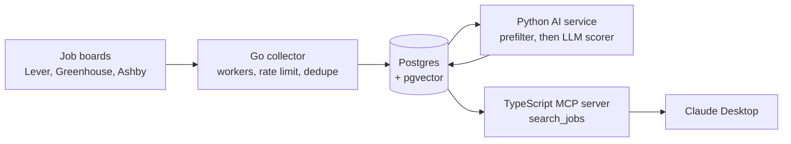
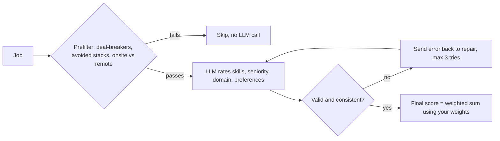

> An AI job-search copilot: collects jobs from public job boards,
> scores them against your profile with an LLM, and serves the
> matches to an AI assistant over MCP.

It's built as three services, one per language:

| Part | Language | What it does | Status |
|---|---|---|---|
| Scoring service | Python (FastAPI, Pydantic, Gemini) | Scores profile–job fit with validated structured LLM output | ✅ v0.2 |
| Collector | Go | Fetches jobs from public job-board APIs (Lever, Greenhouse) | Next |
| MCP server | TypeScript | Lets an AI assistant search jobs and explain matches | Planned |

## Make it yours: profiles

Each user has a folder under `profiles/` with a resume and a `profile.toml`:

```toml
[candidate]
name = "Alex Example"
resume_file = "resume.md"
years_experience = 5

[preferences]
target_titles = ["Backend Engineer", "Senior Software Engineer"]
remote_only = true

[skills]
must_have    = ["Python", "PostgreSQL", "REST APIs"]
nice_to_have = ["Kubernetes", "Kafka"]
avoid        = ["Salesforce", ".NET"]      # jobs with these in the title are skipped

[deal_breakers]
keywords = ["commission only", "night shift"]

[weights]            # what matters most to you; must add up to 100
skills = 40
seniority = 20
domain = 20
preferences = 20

[llm]
provider = "gemini"
```

To add yourself: copy `profiles/example/` to `profiles/<your-name>/`, replace `resume.md` with your resume as plain text, and edit `profile.toml`. Personal profiles are git-ignored, so only the example is shared.


## Why

Job boards optimise for volume. A senior engineer's problem is the
opposite: too many roles, almost none of them a fit. Job Radar reads
each posting against your actual profile and explains the score.


## Architecture


## What's built
- **go/** — collector for public Lever, Greenhouse and Ashby boards.
  Worker pool, per-host rate limiting, dedupe by content hash.
- **py/** — FastAPI scoring service. Free rule-based prefilter, then
  a structured LLM assessment validated with Pydantic and repaired
  on failure. 15 tests against a fake LLM.
- **ts/** — MCP server (in progress).

## Design decisions
- **Prefilter before the LLM.** Most jobs are obvious rejects. Filtering
  them with rules costs nothing; every LLM call costs money.
- **The LLM scores dimensions, code computes the total.** Weights are
  config, not prompt, so tuning them needs no model call.
- **Missing must-haves are constrained to the user's own list**, so the
  model can't invent a requirement you never asked for.

## Run it locally

## Run it

```bash
cd py
python3 -m venv .venv && source .venv/bin/activate
pip install -r requirements.txt
cp .env.example .env                  # then paste your Gemini API key into .env
pytest                                # 15 tests, no API key needed
python -m scripts.score_samples --profile example
uvicorn app.main:app --reload         # API docs at http://127.0.0.1:8000/docs
```

API:

- `GET /profiles` lists available profiles
- `POST /score` with `{"profile": "example", "job": {"title": ..., "company": ..., "description": ...}}` returns the score, or the reason the job was skipped

## Project layout

```
profiles/example/    template profile + resume (copy this)
py/app/profile.py    loads and validates profile.toml
py/app/prefilter.py  free rule-based checks before the LLM
py/app/scorer.py     prompt, validation, retry-and-repair, weighted score
py/app/llm.py        LLM providers (Gemini via google-genai)
py/app/main.py       FastAPI app
py/tests/            unit tests with a fake LLM
py/scripts/          score a JSON file of jobs from the command line
data/                sample job postings
```

## How scoring works



Design choices:

1. **Filter cheaply first.** Rule-based checks skip obvious mismatches for free, so the LLM is only paid for jobs that could fit.
2. **LLM output is untrusted.** The reply must match a JSON schema (Pydantic), stay in range (0–100), and pass rules the schema can't express. For example, the "missing must-haves" it reports must come from your own must-have list, so it can't invent requirements.
3. **Retry-and-repair.** On any failure the exact error goes back to the model to fix, up to 3 attempts; after that the API returns 502 rather than bad data.
4. **Scores computed in code.** The LLM rates the parts; the final score is a weighted sum using each user's weights, so the arithmetic is deterministic and personal.
5. **Swappable provider.** The LLM sits behind a small `LLMClient` interface. Tests use a fake model with no network or API key.

